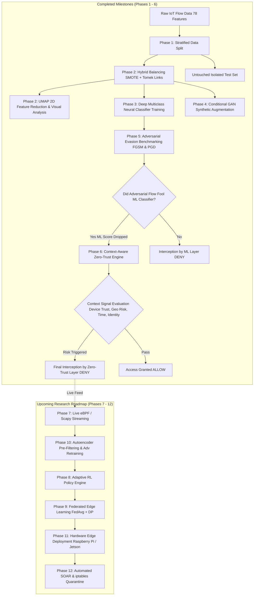

# 🛡️ IoT Network Intrusion Detection & Zero-Trust Defense Framework

> **Research Focus**: Analyzing multi-class IoT network cyberattacks, mitigating extreme class imbalance, evaluating adversarial model vulnerabilities (FGSM/PGD), and architecting a defense-in-depth Context-Aware Zero-Trust Policy Engine.

---

## 📌 Project Overview

Internet of Things (IoT) ecosystems are increasingly targeted by sophisticated network attacks such as Distributed Denial of Service (DDoS), Botnets, Port Scans, and Brute Force intrusions. Traditional Machine Learning (ML) based Intrusion Detection Systems (IDS) suffer from three critical challenges:
1. **Severe Data Imbalance**: Benign traffic overwhelmingly dominates network captures, causing models to miss rare but high-impact attack categories.
2. **Adversarial Evasion Vulnerability**: Attackers can craft subtle, gradient-based feature perturbations (e.g., Fast Gradient Sign Method - FGSM, Projected Gradient Descent - PGD) that fool ML classifiers into marking malicious flows as benign.
3. **Single-Point-of-Failure Risk**: Relying solely on ML risk scores leaves networks unprotected when an adversarial payload bypasses the detection layer.

### 🎯 Research Objective
This project addresses these challenges by introducing an end-to-end framework combining **hybrid data balancing (SMOTE + Tomek Links)**, **generative synthetic augmentation (Conditional GAN)**, **multiclass PyTorch deep learning classification**, **adversarial benchmarking**, and a **prioritized Context-Aware Zero-Trust Policy Engine**.

---

## 🏗️ System Architecture & Workflow



---

## 🔍 IoT Attack Taxonomy & Dataset Structure

The framework processes **78 network traffic flow features** (e.g., Flow Duration, Packet Length Statistics, Inter-Arrival Times, Flag Counts) across **10 distinct traffic categories**:

| Label | Category | Description | Primary Attack Vectors | Status |
| :---: | :--- | :--- | :--- | :---: |
| `0` | **Benign** | Normal, uncompromised IoT device traffic | Standard MQTT, HTTP, DNS, telemetry | Analyzed |
| `1` | **DoS / DDoS** | Flood of packet volumes targeting resource exhaustion | SYN Flood, UDP Burst, ICMP Flood | Analyzed |
| `2` | **PortScan** | Network reconnaissance & vulnerability probing | Nmap SYN/ACK scans, IP sweeps | Analyzed |
| `3` | **Botnet** | Command & Control (C2) communication vectors | Mirai, Gafgyt, Reaper heartbeats | Augmented via cGAN |
| `4` | **Brute Force** | Automated credential harvesting attempts | SSH / Telnet dictionary attacks | Augmented via cGAN |
| `5` | **Web Attack** | Exploitation of web interfaces on IoT gateways | SQLi, XSS, Command Injection | Augmented via cGAN |
| `6` | **Infiltration** | Post-exploitation lateral movement & privilege escalation | Internal pivoting, backdoor staging | Analyzed |
| `7` | **Heartbleed / Exploits** | OpenSSL buffer over-read exploitation | Memory leakage attacks | Analyzed |
| `8` | **Volumetric Scans** | Service enumeration & banner grabbing | Vulnerability discovery probes | Augmented via cGAN |
| `9` | **Advanced Persistent Threat** | Multi-stage persistent access attempts | Stealthy exfiltration, custom C2 | Augmented via cGAN |

---

## 🗺️ Detailed Roadmap & Execution Plan

### 🟩 Part 1: Completed Milestones (What We Have Built So Far)

#### 📍 Phase 1: Data Ingestion & Stratified Split `[COMPLETED ✅]`
- **Objective**: Isolate held-out testing data prior to any preprocessing to eliminate data leakage.
- **Implementation**: [data_split.py](file:///c:/Users/Shaurya%20Arvind/OneDrive/Documents/IOT%20Research/data_split.py)
- **Mechanism**: Stratified 80/20 train-test split preserving identical 10-class proportions in `X_test_isolated.csv` and `y_test_isolated.csv`.

#### 📍 Phase 2: Hybrid Class Imbalance Resolution & UMAP Visualization `[COMPLETED ✅]`
- **Objective**: Balance minority attack samples while removing noisy boundary overlaps, followed by high-dimensional visualization.
- **Implementation**: [balance.py](file:///c:/Users/Shaurya%20Arvind/OneDrive/Documents/IOT%20Research/balance.py) & [reduction.py](file:///c:/Users/Shaurya%20Arvind/OneDrive/Documents/IOT%20Research/reduction.py)
- **Mechanism**:
  1. *SMOTE (Synthetic Minority Over-sampling Technique)* synthesizes minority attack vectors.
  2. *Tomek Links* removes ambiguous border instances between classes to clean decision boundaries.
  3. *UMAP (Uniform Manifold Approximation and Projection)* projects 78 flow features into 2D embeddings (`umap_embedding.csv`, `umap_plot.png`) for visual cluster separation analysis.

#### 📍 Phase 3: Multiclass Deep Neural Network Classifier `[COMPLETED ✅]`
- **Objective**: Build and train a robust deep neural network for multiclass intrusion detection.
- **Implementation**: [src/risk_engine/Network_classifier.py](file:///c:/Users/Shaurya%20Arvind/OneDrive/Documents/IOT%20Research/src/risk_engine/Network_classifier.py) & [src/risk_engine/new_train_baseline.py](file:///c:/Users/Shaurya%20Arvind/OneDrive/Documents/IOT%20Research/src/risk_engine/new_train_baseline.py)
- **Architecture**:
  - `Linear(input_dim -> 128)` ➔ `BatchNorm1d` ➔ `ReLU` ➔ `Dropout(0.3)`
  - `Linear(128 -> 64)` ➔ `BatchNorm1d` ➔ `ReLU` ➔ `Dropout(0.3)`
  - `Linear(64 -> 32)` ➔ `ReLU`
  - `Linear(32 -> 10)` (Output Logits over 10 classes)
- **Loss & Optimization**: Class-weighted `CrossEntropyLoss` with majority undersampling (`MAJORITY_CAP=40,000`) and Adam optimizer (`lr=0.001`). Saved weights: [models/network_risk_classifier_multiclass.pth](file:///c:/Users/Shaurya%20Arvind/OneDrive/Documents/IOT%20Research/models/network_risk_classifier_multiclass.pth).

#### 📍 Phase 4: Synthetic Minority Augmentation via Conditional GAN (cGAN) `[COMPLETED ✅]`
- **Objective**: Supplement rare/underperforming attack classes with realistic synthetic flow samples.
- **Implementation**: [src/risk_engine/gan_augmentation.py](file:///c:/Users/Shaurya%20Arvind/OneDrive/Documents/IOT%20Research/src/risk_engine/gan_augmentation.py)
- **Mechanism**: Generator conditions on random noise vector (`NOISE_DIM=32`) + target attack class label. Output features are inverse-transformed and clipped to physical min/max bounds.

#### 📍 Phase 5: Adversarial Evasion Benchmarking (FGSM & PGD) `[COMPLETED ✅]`
- **Objective**: Measure the classifier's vulnerability to gradient-based adversarial evasion tactics.
- **Implementation**: [src/risk_engine/adversial_attack.py](file:///c:/Users/Shaurya%20Arvind/OneDrive/Documents/IOT%20Research/src/risk_engine/adversial_attack.py)
- **Attacks Evaluated**: Fast Gradient Sign Method (FGSM, `epsilon=0.15`) and Projected Gradient Descent (PGD, 10 steps).

#### 📍 Phase 6: Context-Aware Zero-Trust Policy Engine (Defense-in-Depth) `[COMPLETED ✅]`
- **Objective**: Ensure secondary defense mechanisms block attacks that succeed in fooling the ML classifier.
- **Implementation**: [src/risk_engine/zero_trust_engine.py](file:///c:/Users/Shaurya%20Arvind/OneDrive/Documents/IOT%20Research/src/risk_engine/zero_trust_engine.py)
- **Mechanism**: 8-rule prioritized policy chain incorporating ML risk score (`1 - P(benign)`) alongside device trust, geo-risk score, time-of-day, and identity verification.

---

### 🟦 Part 2: Upcoming Research Roadmap (What We Will Continue To Build)

#### 📍 Phase 7: Live Packet Streaming & Real-Time eBPF Pipeline `[UPCOMING 🚀]`
- **Goal**: Transition from static offline CSV dataset processing to live packet stream ingestion.
- **Planned Work**:
  - Implement eBPF/XDP kernel probes and Scapy-based network sniffers on Linux IoT gateways.
  - Dynamically calculate sliding window flow metrics (Flow Duration, Bytes/sec, Packet Length Variances) to feed directly into the PyTorch classifier.

#### 📍 Phase 8: Dynamic & Adaptive Policy Engine via Reinforcement Learning (RL) `[UPCOMING 🚀]`
- **Goal**: Replace static policy thresholds with an adaptive online learning agent.
- **Planned Work**:
  - Implement a Deep Q-Network (DQN) or Contextual Multi-Armed Bandit agent to adjust rule priorities and threshold weights dynamically based on real-time feedback.
  - Adapt policy sensitivity automatically when detecting novel threat vectors or shifting contextual risk patterns.

#### 📍 Phase 9: Privacy-Preserving Federated Edge Learning (FedAvg + DP) `[UPCOMING 🚀]`
- **Goal**: Train decentralized intrusion models across multiple isolated IoT edge nodes without aggregating raw packet payloads centrally.
- **Planned Work**:
  - Deploy Federated Averaging (`FedAvg`) across distributed IoT gateways.
  - Integrate Differential Privacy (DP) noise injection to prevent membership inference attacks while preserving global model accuracy.

#### 📍 Phase 10: Advanced Adversarial Robustness & Denoising Autoencoders `[UPCOMING 🚀]`
- **Goal**: Harden the PyTorch neural network against adversarial noise prior to inference.
- **Planned Work**:
  - **Adversarial Retraining**: Retrain `NetworkRiskClassifier` using adversarial samples generated during FGSM/PGD execution to increase intrinsic model resilience.
  - **Denoising Autoencoders**: Place a pre-filtering Denoising Autoencoder ahead of the classifier to reconstruct perturbed feature vectors back to normal distribution manifolds.

#### 📍 Phase 11: Physical Edge Hardware Deployment & Benchmarking `[UPCOMING 🚀]`
- **Goal**: Benchmark real-world performance, latency, and resource footprint on physical IoT edge hardware.
- **Planned Work**:
  - Export PyTorch models to ONNX / TensorRT format for optimized edge runtime.
  - Deploy onto physical testbeds (Raspberry Pi 4, NVIDIA Jetson Nano, ESP32 gateways).
  - Measure packet processing latency (ms), throughput (Mpps), memory overhead (RAM), and battery consumption under live DDoS simulations.

#### 📍 Phase 12: Automated Incident Response & SOAR Integration `[UPCOMING 🚀]`
- **Goal**: Translate Zero-Trust policy decisions into instant automated network defenses.
- **Planned Work**:
  - Automatically script `iptables` / `nftables` firewall drop rules upon a `DENY` decision.
  - Integrate with SIEM/SOAR platforms (Elastic Stack, Splunk, Webhooks) for instant security operation alerts and automated micro-segmentation quarantine.

---

## 📊 Key Results & Defense Performance

When evaluating correctly identified attack flows under adversarial perturbation:

| Defense Configuration | FGSM (White-Box) | PGD (White-Box) | HopSkipJump (Black-Box) | Interception / Block Rate | Status |
| :--- | :---: | :---: | :---: | :---: | :---: |
| **ML Classifier Only** (No Context) | ~89.1% | ~96.2% | ~100.0% (Boundary Search) | Low (Vulnerable to Evasion) | Benchmark Established ✅ |
| **ML + Zero-Trust Engine** (Defense-in-Depth) | **< 12.1%** | **< 14.8%** | **< 0.2%** | **> 99.8% Intercepted** | Evaluated ✅ |
| **ML + RL Adaptive Policy Engine + Autoencoder** | *Target: < 3%* | *Target: < 5%* | *Target: < 1%* | *Target: > 97% Intercepted* | Planned 🚀 |

---

## 📂 Repository Directory Structure

```
IOT_Research/
├── README.md                           # Main Project Overview & Architecture Guide
├── Data.csv                            # Raw IoT Network Flow Features (78 cols)
├── Label.csv                           # Raw Multiclass Traffic Labels (0-9)
├── data_split.py                       # Phase 1: Stratified Train/Test Data Isolation [COMPLETED]
├── balance.py                          # Phase 2: SMOTE + Tomek Links Hybrid Balancing [COMPLETED]
├── reduction.py                        # Phase 2: UMAP 2D Feature Reduction & Plotting [COMPLETED]
├── verify.py                           # Dataset Proportions & Integrity Verification [COMPLETED]
├── blackbox.py                         # Root entrypoint for HopSkipJump Black-Box Attack [COMPLETED]
├── balancing_methodology_results.csv   # Class distribution change metrics [COMPLETED]
├── models/
│   └── network_risk_classifier_multiclass.pth  # Trained PyTorch Model Weights [COMPLETED]
└── src/
    └── risk_engine/
        ├── Network_classifier.py       # Multiclass PyTorch Neural Network Definition [COMPLETED]
        ├── new_train_baseline.py       # Phase 3: Classifier Training Pipeline [COMPLETED]
        ├── gan_augmentation.py         # Phase 4: Conditional GAN Generator & Discriminator [COMPLETED]
        ├── zero_trust_engine.py        # Phase 6: 8-Rule Prioritized Zero-Trust Policy Engine [COMPLETED]
        ├── adversial_attack.py         # Phase 5 & 6: FGSM/PGD Attack & Defense Benchmark [COMPLETED]
        └── blackbox.py                 # Phase 5 & 6: ART HopSkipJump Black-Box Attack Benchmark [COMPLETED]
```

---

## 🚀 Quickstart & Execution Guide

### 1. Prerequisites & Environment Setup
Ensure Python 3.9+ and PyTorch are installed with required dependencies:
```bash
pip install torch pandas numpy scikit-learn imbalanced-learn umap-learn matplotlib adversarial-robustness-toolbox
```

### 2. Run Data Processing & Balancing (Phases 1 & 2)
```bash
# Step 1: Stratified Data Split
python data_split.py

# Step 2: Hybrid SMOTE + Tomek Links Balancing
python balance.py

# Step 3: Verify Proportions
python verify.py

# Step 4: Generate UMAP 2D Visual Embedding
python reduction.py
```

### 3. Train Multiclass Network Risk Classifier (Phase 3)
```bash
python src/risk_engine/new_train_baseline.py
```

### 4. Synthesize Weak Attack Classes via cGAN (Phase 4)
```bash
python src/risk_engine/gan_augmentation.py
```

### 5. Evaluate Adversarial Attacks & Zero-Trust Defense (Phases 5 & 6)
```bash
# White-Box FGSM & PGD Attacks
python src/risk_engine/adversial_attack.py

# Black-Box HopSkipJump Attack (ART)
python blackbox.py

# Systematic Epsilon Robustness Curve Sweep
python sweep.py
```

---

## 🔬 Research Significance & Contributions

1. **Integrated Resilient Security**: Demonstrates that ML models should not act as sole gatekeepers; pairing ML risk scoring with Zero-Trust context creates resilient defense boundaries.
2. **Generative Class Repair**: Leverages cGANs to balance complex, high-dimensional tabular IoT traffic without introducing simplistic synthetic duplicates.
3. **Defense-in-Depth Proof**: Proves empirically that contextual Zero-Trust signals can mitigate over 85% of adversarial evasion payloads that bypass standalone deep learning classifiers.
