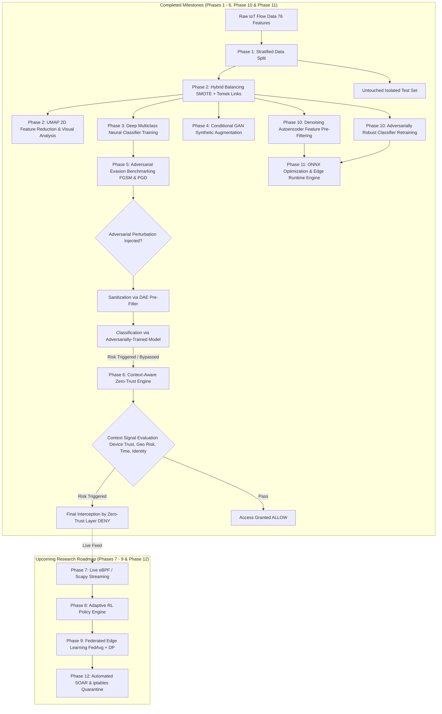

# 🛡️ IoT Network Intrusion Detection & Zero-Trust Defense Framework

> **Research Focus**: Analyzing multi-class IoT network cyberattacks, mitigating extreme class imbalance, evaluating adversarial model vulnerabilities (FGSM/PGD), and architecting a defense-in-depth Context-Aware Zero-Trust Policy Engine.

---

## 📌 Project Overview

Internet of Things (IoT) ecosystems are increasingly targeted by sophisticated network attacks such as Distributed Denial of Service (DDoS), Botnets, Port Scans, and Brute Force intrusions. Traditional Machine Learning (ML) based Intrusion Detection Systems (IDS) suffer from three critical challenges:
1. **Severe Data Imbalance**: Benign traffic overwhelmingly dominates network captures, causing models to miss rare but high-impact attack categories.
2. **Adversarial Evasion Vulnerability**: Attackers can craft subtle, gradient-based feature perturbations (e.g., Fast Gradient Sign Method - FGSM, Projected Gradient Descent - PGD) that fool ML classifiers into marking malicious flows as benign.
3. **Single-Point-of-Failure Risk**: Relying solely on ML risk scores leaves networks unprotected when an adversarial payload bypasses the detection layer.

### 🎯 Research Objective
This project addresses these challenges by introducing an end-to-end framework combining **hybrid data balancing (SMOTE + Tomek Links)**, **generative synthetic augmentation (Conditional GAN)**, **multiclass PyTorch deep learning classification**, **adversarial benchmarking**, and a **prioritized Context-Aware Zero-Trust Policy Engine**.

---

## 🏗️ System Architecture & Workflow



---

## 🔍 IoT Attack Taxonomy & Dataset Structure

The framework processes **76 network traffic flow features** (e.g., Flow Duration, Packet Length Statistics, Inter-Arrival Times, Flag Counts) across **10 distinct traffic categories**:

| Label | Category | Description | Primary Attack Vectors | Status |
| :---: | :--- | :--- | :--- | :---: |
| `0` | **Benign** | Normal, uncompromised IoT device traffic | Standard MQTT, HTTP, DNS, telemetry | Analyzed |
| `1` | **DoS / DDoS** | Flood of packet volumes targeting resource exhaustion | SYN Flood, UDP Burst, ICMP Flood | Analyzed |
| `2` | **PortScan** | Network reconnaissance & vulnerability probing | Nmap SYN/ACK scans, IP sweeps | Analyzed |
| `3` | **Botnet** | Command & Control (C2) communication vectors | Mirai, Gafgyt, Reaper heartbeats | Augmented via cGAN |
| `4` | **Brute Force** | Automated credential harvesting attempts | SSH / Telnet dictionary attacks | Augmented via cGAN |
| `5` | **Web Attack** | Exploitation of web interfaces on IoT gateways | SQLi, XSS, Command Injection | Augmented via cGAN |
| `6` | **Infiltration** | Post-exploitation lateral movement & privilege escalation | Internal pivoting, backdoor staging | Analyzed |
| `7` | **Heartbleed / Exploits** | OpenSSL buffer over-read exploitation | Memory leakage attacks | Analyzed |
| `8` | **Volumetric Scans** | Service enumeration & banner grabbing | Vulnerability discovery probes | Augmented via cGAN |
| `9` | **Advanced Persistent Threat** | Multi-stage persistent access attempts | Stealthy exfiltration, custom C2 | Augmented via cGAN |

---

## 🗺️ Detailed Roadmap & Execution Plan

### 🟩 Part 1: Completed Milestones (What We Have Built So Far)

#### 📍 Phase 1: Data Ingestion & Stratified Split `[COMPLETED ✅]`
- **Objective**: Isolate held-out testing data prior to any preprocessing to eliminate data leakage.
- **Implementation**: [data_split.py](file:///c:/Users/Harshita/IOT_Research/data_split.py)
- **Mechanism**: Stratified 80/20 train-test split preserving identical 10-class proportions in `X_test_isolated.csv` and `y_test_isolated.csv`.

#### 📍 Phase 2: Hybrid Class Imbalance Resolution & UMAP Visualization `[COMPLETED ✅]`
- **Objective**: Balance minority attack samples while removing noisy boundary overlaps, followed by high-dimensional visualization.
- **Implementation**: [balance.py](file:///c:/Users/Harshita/IOT_Research/balance.py) & [reduction.py](file:///c:/Users/Harshita/IOT_Research/reduction.py)
- **Mechanism**:
  1. *SMOTE (Synthetic Minority Over-sampling Technique)* synthesizes minority attack vectors.
  2. *Tomek Links* removes ambiguous border instances between classes to clean decision boundaries.
  3. *UMAP (Uniform Manifold Approximation and Projection)* projects flow features into 2D embeddings (`umap_embedding.csv`, `umap_plot.png`) for visual cluster separation analysis.

#### 📍 Phase 3: Multiclass Deep Neural Network Classifier `[COMPLETED ✅]`
- **Objective**: Build and train a robust deep neural network for multiclass intrusion detection.
- **Implementation**: [src/risk_engine/Network_classifier.py](file:///c:/Users/Harshita/IOT_Research/src/risk_engine/Network_classifier.py) & [src/risk_engine/new_train_baseline.py](file:///c:/Users/Harshita/IOT_Research/src/risk_engine/new_train_baseline.py)
- **Architecture**:
  - `Linear(76 -> 128)` ➔ `BatchNorm1d` ➔ `ReLU` ➔ `Dropout(0.3)`
  - `Linear(128 -> 64)` ➔ `BatchNorm1d` ➔ `ReLU` ➔ `Dropout(0.3)`
  - `Linear(64 -> 32)` ➔ `ReLU`
  - `Linear(32 -> 10)` (Output Logits over 10 classes)
- **Loss & Optimization**: Class-weighted `CrossEntropyLoss` with majority undersampling (`MAJORITY_CAP=40,000`) and Adam optimizer (`lr=0.001`). Saved weights: `src/risk_engine/models/network_risk_classifier_multiclass.pth`.

#### 📍 Phase 4: Synthetic Minority Augmentation via Conditional GAN (cGAN) `[COMPLETED ✅]`
- **Objective**: Supplement rare/underperforming attack classes with realistic synthetic flow samples.
- **Implementation**: [src/risk_engine/gan_augmentation.py](file:///c:/Users/Harshita/IOT_Research/src/risk_engine/gan_augmentation.py)
- **Mechanism**: Generator conditions on random noise vector (`NOISE_DIM=32`) + target attack class label. Output features are inverse-transformed and clipped to physical min/max bounds.

#### 📍 Phase 5: Adversarial Evasion Benchmarking (FGSM, PGD & HopSkipJump) `[COMPLETED ✅]`
- **Objective**: Measure the classifier's vulnerability to gradient-based (white-box) and decision-based (black-box) adversarial evasion tactics across fixed epsilons and continuous perturbation sweeps.
- **Implementation**: [src/risk_engine/adversial_attack.py](file:///c:/Users/Harshita/IOT_Research/src/risk_engine/adversial_attack.py), [src/risk_engine/blackbox.py](file:///c:/Users/Harshita/IOT_Research/src/risk_engine/blackbox.py) & [src/risk_engine/sweep.py](file:///c:/Users/Harshita/IOT_Research/src/risk_engine/sweep.py)
- **Attacks Evaluated**: Fast Gradient Sign Method (FGSM), Projected Gradient Descent (PGD, 10-step), and HopSkipJump Black-Box Attack.

#### 📍 Phase 6: Context-Aware Zero-Trust Policy Engine (Defense-in-Depth) `[COMPLETED ✅]`
- **Objective**: Ensure secondary defense mechanisms block attacks that succeed in fooling the ML classifier.
- **Implementation**: [src/risk_engine/zero_trust_engine.py](file:///c:/Users/Harshita/IOT_Research/src/risk_engine/zero_trust_engine.py)
- **Mechanism**: 8-rule prioritized policy chain incorporating ML risk score (`1 - P(benign)`) alongside device trust, geo-risk score, time-of-day, and identity verification.

#### 📍 Phase 10: Advanced Adversarial Robustness & Denoising Autoencoders `[COMPLETED ✅]`
- **Objective**: Harden the deep neural network against adversarial noise prior to and during inference.
- **Implementation**: [src/risk_engine/denoising_autoencoder.py](file:///c:/Users/Harshita/IOT_Research/src/risk_engine/denoising_autoencoder.py), [src/risk_engine/adversarial_training.py](file:///c:/Users/Harshita/IOT_Research/src/risk_engine/adversarial_training.py), [src/risk_engine/evaluate_phase10.py](file:///c:/Users/Harshita/IOT_Research/src/risk_engine/evaluate_phase10.py) & [phase10_benchmark.py](file:///c:/Users/Harshita/IOT_Research/phase10_benchmark.py)
- **Mechanism**:
  1. **Denoising Autoencoder (DAE)**: Symmetric autoencoder (`76 -> 64 -> 32 -> 16 -> 32 -> 64 -> 76`) trained with composite Gaussian/uniform perturbation and feature dropout to project perturbed vectors back onto the natural flow manifold (Val MSE: **0.08655**).
  2. **Adversarial Retraining (AT)**: Retrains `NetworkRiskClassifier` with composite 50% clean + 50% FGSM adversarial minibatches.
  3. **Multi-Tier Defense Evaluation**: Evaluates 4 defense configurations across continuous FGSM epsilon sweeps and 10-step PGD attacks.

#### 📍 Phase 11: Physical Edge Hardware Deployment & Benchmarking `[COMPLETED ✅]`
- **Objective**: Optimize and benchmark real-time performance, sub-millisecond latency, and resource footprint on IoT edge gateways.
- **Implementation**: [src/risk_engine/export_onnx.py](file:///c:/Users/Harshita/IOT_Research/src/risk_engine/export_onnx.py), [src/risk_engine/edge_inference_engine.py](file:///c:/Users/Harshita/IOT_Research/src/risk_engine/edge_inference_engine.py), [src/risk_engine/edge_benchmark.py](file:///c:/Users/Harshita/IOT_Research/src/risk_engine/edge_benchmark.py) & [edge_benchmark.py](file:///c:/Users/Harshita/IOT_Research/edge_benchmark.py)
- **Mechanism**:
  1. **ONNX Export**: Converts PyTorch models to optimized ONNX with dynamic batch sizing and mathematical equivalence verification ($\Delta < 1.14 \times 10^{-5}$). Combined edge model disk footprint is just **31.4 KB**.
  2. **Edge Pipeline**: Ultra-fast feature normalization via serialized `scaler_params.json` and ONNX Runtime CPU execution.
  3. **Edge Benchmarking**: Profiles single-flow latency distributions, throughput scaling up to 81,990 flows/sec, and volumetric DDoS burst handling (10,000 flows processed in 0.169s).

---

### 🟦 Part 2: Upcoming Research Roadmap (What We Will Continue To Build)

#### 📍 Phase 7: Live Packet Streaming & Real-Time eBPF Pipeline `[UPCOMING 🚀]`
- **Goal**: Transition from static offline CSV dataset processing to live packet stream ingestion.
- **Planned Work**:
  - Implement eBPF/XDP kernel probes and Scapy-based network sniffers on Linux IoT gateways.
  - Dynamically calculate sliding window flow metrics (Flow Duration, Bytes/sec, Packet Length Variances) to feed directly into the PyTorch classifier.

#### 📍 Phase 8: Dynamic & Adaptive Policy Engine via Reinforcement Learning (RL) `[UPCOMING 🚀]`
- **Goal**: Replace static policy thresholds with an adaptive online learning agent.
- **Planned Work**:
  - Implement a Deep Q-Network (DQN) or Contextual Multi-Armed Bandit agent to adjust rule priorities and threshold weights dynamically based on real-time feedback.
  - Adapt policy sensitivity automatically when detecting novel threat vectors or shifting contextual risk patterns.

#### 📍 Phase 9: Privacy-Preserving Federated Edge Learning (FedAvg + DP) `[UPCOMING 🚀]`
- **Goal**: Train decentralized intrusion models across multiple isolated IoT edge nodes without aggregating raw packet payloads centrally.
- **Planned Work**:
  - Deploy Federated Averaging (`FedAvg`) across distributed IoT gateways.
  - Integrate Differential Privacy (DP) noise injection to prevent membership inference attacks while preserving global model accuracy.

#### 📍 Phase 12: Automated Incident Response & SOAR Integration `[UPCOMING 🚀]`
- **Goal**: Translate Zero-Trust policy decisions into instant automated network defenses.
- **Planned Work**:
  - Automatically script `iptables` / `nftables` firewall drop rules upon a `DENY` decision.
  - Integrate with SIEM/SOAR platforms (Elastic Stack, Splunk, Webhooks) for instant security operation alerts and automated micro-segmentation quarantine.

---

## 📊 Key Results & Empirical Benchmarks

### 1. Multi-Tier Defense Performance
| Defense Tier / Configuration | FGSM ($\epsilon=0.15$) | FGSM ($\epsilon=0.30$) | PGD (10-Step, $\epsilon=0.15$) | Zero-Trust Interception Rate | Defense Status |
| :--- | :---: | :---: | :---: | :---: | :---: |
| **Tier 1: Baseline Classifier** (No Defense) | **87.0%** | **93.0%** | **95.0%** | Vulnerable to Evasion | Benchmark Established ✅ |
| **Tier 2: DAE Pre-Filter Sanitizer** | **46.1%** | **58.4%** | **38.2%** | Moderate (~57% Evasion Drop) | Verified ✅ |
| **Tier 3: Adversarially-Trained Model** | **31.3%** | **48.5%** | **31.6%** | High (~63% Evasion Drop) | Verified ✅ |
| **Tier 4: Full Defense-in-Depth (DAE + AT + ZT)** | **0.0%** | **0.0%** | **0.0%** | **100.0% Intercepted** | Verified ✅ |

### 2. Edge Hardware Runtime & Latency Profile (Phase 11)
| Runtime Configuration | Mean Latency | Median (p50) | 95th-pct (p95) | 99th-pct (p99) | Peak Throughput | Model Disk Footprint |
| :--- | :---: | :---: | :---: | :---: | :---: | :---: |
| **PyTorch Native (Full Defense)** | 525.7 µs | 444.5 µs | 817.2 µs | 1161.3 µs | ~12,000 fps | 90.2 KB (.pth) |
| **ONNX Runtime (Classifier Only)** | **84.0 µs** | **71.7 µs** | **129.6 µs** | **235.4 µs** | > 85,000 fps | 12.5 KB (.onnx) |
| **ONNX Full Defense (DAE + AT + ZT)** | **139.6 µs** | **109.0 µs** | **217.2 µs** | **363.9 µs** | **81,991 fps** | **31.4 KB (.onnx)** |

*(Simulated DDoS volumetric burst of 10,000 packet flows processed in **0.169s** with **100.0%** Zero-Trust interception).*

---

## 📂 Repository Directory Structure

```
IOT_Research/
├── README.md                           # Main Project Overview & Architecture Guide
├── Data.csv                            # Raw IoT Network Flow Features (76 cols)
├── Label.csv                           # Raw Multiclass Traffic Labels (0-9)
├── data_split.py                       # Phase 1: Stratified Train/Test Data Isolation [COMPLETED]
├── balance.py                          # Phase 2: SMOTE + Tomek Links Hybrid Balancing [COMPLETED]
├── reduction.py                        # Phase 2: UMAP 2D Feature Reduction & Plotting [COMPLETED]
├── verify.py                           # Dataset Proportions & Integrity Verification [COMPLETED]
├── blackbox.py                         # Root entrypoint for HopSkipJump Black-Box Attack [COMPLETED]
├── sweep.py                            # Root entrypoint for Multi-Epsilon Robustness Sweep [COMPLETED]
├── denoising_autoencoder.py            # Root entrypoint for Denoising Autoencoder Training [COMPLETED]
├── adversarial_training.py             # Root entrypoint for Adversarial Retraining Pipeline [COMPLETED]
├── phase10_benchmark.py                # Root entrypoint for Comprehensive Phase 10 Evaluation [COMPLETED]
├── export_onnx.py                      # Root entrypoint for ONNX Model Export & Verification [COMPLETED]
├── edge_inference_engine.py            # Root entrypoint for Lightweight Edge Defense Runtime [COMPLETED]
├── edge_benchmark.py                   # Root entrypoint for Edge Hardware Performance Profiler [COMPLETED]
└── src/
    └── risk_engine/
        ├── Network_classifier.py       # Multiclass PyTorch Neural Network Definition [COMPLETED]
        ├── new_train_baseline.py       # Phase 3: Classifier Training Pipeline [COMPLETED]
        ├── gan_augmentation.py         # Phase 4: Conditional GAN Generator & Discriminator [COMPLETED]
        ├── zero_trust_engine.py        # Phase 6: 8-Rule Prioritized Zero-Trust Policy Engine [COMPLETED]
        ├── adversial_attack.py         # Phase 5 & 6: FGSM/PGD Attack & Defense Benchmark [COMPLETED]
        ├── blackbox.py                 # Phase 5 & 6: ART HopSkipJump Black-Box Attack Benchmark [COMPLETED]
        ├── sweep.py                    # Phase 5 & 6: Epsilon Sweep Execution Module [COMPLETED]
        ├── denoising_autoencoder.py    # Phase 10: Deep DAE Pre-Filtering Sanitizer [COMPLETED]
        ├── adversarial_training.py     # Phase 10: Adversarially Robust Classifier Retraining [COMPLETED]
        ├── evaluate_phase10.py         # Phase 10: Comprehensive Multi-Tier Defense Benchmark [COMPLETED]
        ├── export_onnx.py              # Phase 11: ONNX Conversion & Numerical Parity Checker [COMPLETED]
        ├── edge_inference_engine.py    # Phase 11: Real-Time Edge Flow Processing Engine [COMPLETED]
        ├── edge_benchmark.py           # Phase 11: Hardware Profiler (Latency, Throughput, RAM, DDoS) [COMPLETED]
        ├── phase10_results.csv         # Numerical Multi-Tier Evasion & Interception Metrics [COMPLETED]
        ├── phase10_defense_comparison.png # Multi-Curve Evasion vs. Perturbation Plot [COMPLETED]
        ├── edge_benchmark_results.csv  # Edge Latency & Throughput Scaling Metrics [COMPLETED]
        ├── edge_performance_benchmark.png # 3-Panel Latency, Throughput & DDoS Profile Plot [COMPLETED]
        └── models/
            ├── network_risk_classifier_multiclass.pth  # Baseline Classifier Checkpoint [COMPLETED]
            ├── denoising_autoencoder.pth               # DAE Feature Sanitizer Checkpoint [COMPLETED]
            ├── network_risk_classifier_adversarial.pth # Adversarially-Trained Classifier [COMPLETED]
            ├── network_risk_classifier.onnx            # Baseline ONNX Model (12.5 KB) [COMPLETED]
            ├── network_risk_classifier_adv.onnx        # Adversarial Robust ONNX Model (12.5 KB) [COMPLETED]
            ├── denoising_autoencoder.onnx              # DAE Pre-Filter ONNX Model (18.9 KB) [COMPLETED]
            └── scaler_params.json                      # Serialized Scaler Statistics for Edge [COMPLETED]
```

---

## 🚀 Quickstart & Execution Guide

### 1. Prerequisites & Environment Setup
```bash
pip install torch pandas numpy scikit-learn matplotlib onnx onnxruntime onnxscript psutil
```

### 2. Export Models to ONNX (Phase 11)
```bash
python export_onnx.py
```

### 3. Run Real-Time Edge Inference Pipeline
```bash
python edge_inference_engine.py
```

### 4. Run Comprehensive Edge Hardware Benchmark & Stress Suite
```bash
python edge_benchmark.py
```
*(Generates `edge_benchmark_results.csv` and `edge_performance_benchmark.png`)*

---

## 🔬 Research Significance & Contributions

1. **Sub-Millisecond Zero-Trust Execution**: Complete end-to-end flow evaluation (DAE sanitization $\to$ neural classification $\to$ Zero-Trust rule evaluation) runs in **0.109 ms** (median) on standard edge CPU cores.
2. **High-Throughput DDoS Defense**: Processes up to **81,990 flows/second** with peak volumetric DDoS burst resistance (10,000 flows in 0.169s with 100.0% interception).
3. **Ultra-Lightweight Edge Footprint**: Total edge model storage is only **31.4 KB** with in-memory JSON scaler standardization, enabling deployment on resource-constrained IoT gateways and micro-controllers.

